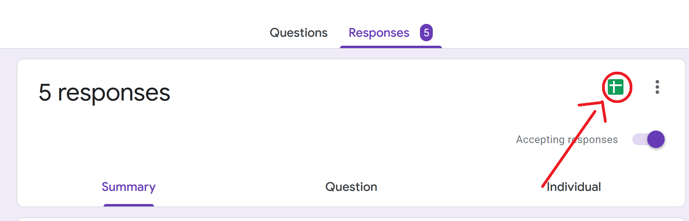
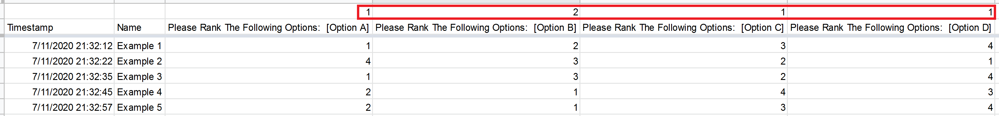

# Automated Group Assignment
This program uses ranked preferences to automatically assign people into groups.

**Warning:** This program does not work well when there are significantly less people than slots.
# How To Use:

####Step 1: Make a survey using the template below
[Template](https://docs.google.com/forms/d/1jk0dyiQ3vHuZ6gXAn9EbmyKYn98Bi8_CC1COqMf62FM/copy)

####Step 2: Export the survey data into Google Sheets

####Step 3: Insert a row on top and add in the amount of slots available in each category

####Step 4: Download the google sheets file as an .xlsx file

####Step 5: Create a blank .txt file

####Step 6: Run the .jar file, you will prompted to selected 2 files
* The first file is the .xlsx file you downloaded
* The second file is the .txt file you want to print to

####Step 7: Read the .txt file and check the results!
